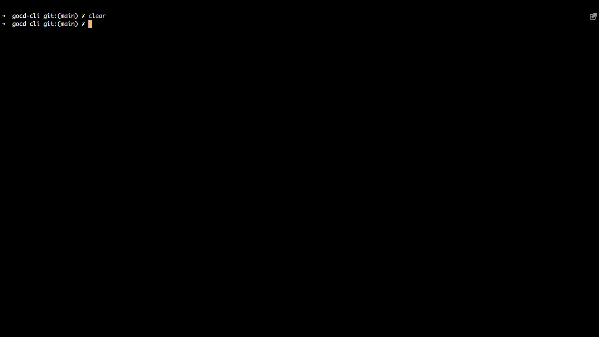

# GoCD commandline interface

[](https://goreportcard.com/report/github.com/nikhilsbhat/gocd-cli)
[](https://github.com/nikhilsbhat/gocd-cli/blob/main/LICENSE)
[](https://godoc.org/github.com/nikhilsbhat/gocd-cli)
[](https://github.com/nikhilsbhat/gocd-cli/tags)
[](https://github.com/nikhilsbhat/gocd-cli/releases)

command-line interface for `GoCD` that helps in interacting with [GoCD](https://www.gocd.org/) server.

## Introduction

While GoCD offers a user interface for performing various tasks, this CLI is designed for administrators responsible for managing GoCD.
It aims to provide CLI-based functionality equivalent to the UI.

This tool communicates with the `GoCD` server's API to perform tasks such as encrypting and decrypting secrets, retrieving lists of pipelines, creating configuration repositories, and more.

This CLI utilizes the GoCD Golang [SDK](https://github.com/nikhilsbhat/gocd-sdk-go). If you encounter a bug with the CLI, it likely originates from the SDK.

## Requirements

* [Go](https://golang.org/dl/) 1.17 or above . Installing go can be found [here](https://golang.org/doc/install).
* Basic understanding of CI/CD server [GoCD](https://www.gocd.org/) and GoCD golang [sdk](https://github.com/nikhilsbhat/gocd-sdk-go).

## Authorization

The authorization configuration for GoCD can be locally cached for future use, streamlining subsequent operations.

The command `auth-config` will do the work.

```shell
# Running the below command should cache configurations under $HOME/.gocd/auth_config.yaml.
gocd-cli auth-config store --server-url <gocd-url> --username <username> --password <password>

# User creds cached can be validated using below command.
gocd-cli who-am-i
# The response to the above command should be:
# user: admin

# Once we have authorization configurations cached, we do not need to pass the credentials every time we invoke the cli.
gocd-cli environment list
```

## Update

The `gocd-cli` will display any pending updates in a diff format, similar to how it is commonly done in other CLI tools such as Terraform.



## Documentation

Updated documentation on all available commands and flags can be found [here](https://github.com/nikhilsbhat/gocd-cli/blob/main/docs/doc/gocd-cli.md).

## Installation

* Recommend installing released versions. Release binaries are available on the [releases](https://github.com/nikhilsbhat/gocd-cli/releases) page and docker from [here](https://hub.docker.com/repository/docker/basnik/gocd-cli).
* Can always build it locally by running `go build` against cloned repo.

#### Docker

Latest version of docker images are published to [ghcr.io](https://github.com/nikhilsbhat/gocd-cli/pkgs/container/gocd-cli), all available images can be found there. </br>

```bash
docker pull ghcr.io/nikhilsbhat/gocd-cli:latest
docker pull ghcr.io/nikhilsbhat/gocd-cli:<github-release-tag>
```

### Note

* The `gocd-cli pipeline validate-syntax` command utilizes GoCD's plugin binary to validate the syntax of the pipeline.
* As the plugins are in JAR format, Java installation is required on the machine where the command will be executed.
